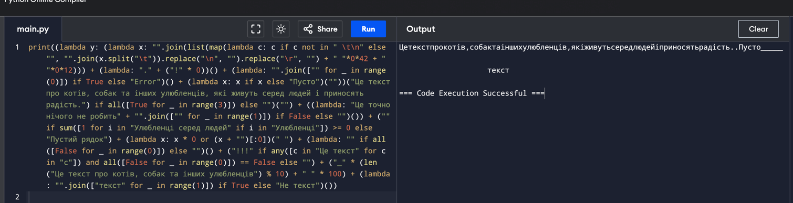

# Завдання 
Створіть однорядковий код, який зібрав би всіх домашніх улюбленців з інтернету в один масив, але по факту — просто стисніть великий текст так, щоб його можна було прочитати людині.

Мова - Python

# Output


# Запустити код
Є декілька варіантів як можна запустити код, розглянемо кожний

1.
* Скачати docker на локальну машину
* git clone this project
* docker-compose up -d --build


2. 
* Скачати пайтон з ```https://www.python.org/downloads/```
* git clone this project
    ### On Macos
* Create a virtual environment `python3 -m venv venv`
* source venv/bin/activate
    ### On Windows
* Create a virtual environment `python -m venv venv`
* venv\Scripts\activate
    ### На обох платформах
* python main.py


3. 
* Зайти на посилання з онлайн компілятором `https://www.programiz.com/python-programming/online-compiler/`
* В файлі main.py скопіювати увесь код та вставити на платформу
* Натисніть `Run` для виконання коду.
